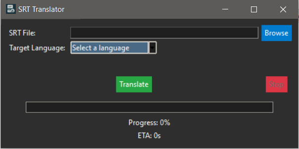

# SRT Translator

A Python GUI tool to translate `.srt` subtitle files into any language using Google Translate.


## Features
- 📁 Load `.srt` files easily via file browser.
- 🌐 Auto-detects the source language.
- 🗣️ Choose target language from a dropdown.
- 🚀 Real-time progress bar and estimated time of completion (ETA).
- 🛑 Stop button to abort the translation and save partial results.
- 💾 Saves the translated subtitles into a new `.srt` file.

## Screenshots

*(Insert a screenshot of the app window here)*

## Requirements
- Python 3.7+
- Libraries:
  - `tkinter` (standard with Python)
  - `googletrans==4.0.0-rc1`

Install dependencies:
```bash
pip install googletrans==4.0.0-rc1
```

## Usage
1. Run the script:
   ```bash
   python srt_translator.py
   ```
2. Click `Browse` to select your `.srt` file.
3. Choose the target language from the dropdown.
4. Click `Translate` to start the translation.
5. View the progress and estimated time.
6. Click `Stop` if you want to cancel and save what is done.
7. Save the translated file when prompted.

## How it Works
- The tool reads your `.srt` file and auto-detects the source language.
- It translates block-by-block while preserving time codes.
- Translation progress is tracked with a live progress bar.
- The "Stop" button interrupts the translation loop safely and saves the partial results.

## Limitations
- `googletrans` uses an unofficial API and may occasionally fail or be rate-limited.
- The quality of translation depends on the Google Translate service.
- Large `.srt` files may result in slower processing.

## License
MIT License

```
MIT License

Copyright (c) 2025

Permission is hereby granted, free of charge, to any person obtaining a copy
of this software and associated documentation files (the "Software"), to deal
in the Software without restriction, including without limitation the rights
to use, copy, modify, merge, publish, distribute, sublicense, and/or sell
copies of the Software, and to permit persons to whom the Software is
furnished to do so, subject to the following conditions:

The above copyright notice and this permission notice shall be included in all
copies or substantial portions of the Software.

THE SOFTWARE IS PROVIDED "AS IS", WITHOUT WARRANTY OF ANY KIND, EXPRESS OR
IMPLIED, INCLUDING BUT NOT LIMITED TO THE WARRANTIES OF MERCHANTABILITY,
FITNESS FOR A PARTICULAR PURPOSE AND NONINFRINGEMENT. IN NO EVENT SHALL THE
AUTHORS OR COPYRIGHT HOLDERS BE LIABLE FOR ANY CLAIM, DAMAGES OR OTHER
LIABILITY, WHETHER IN AN ACTION OF CONTRACT, TORT OR OTHERWISE, ARISING FROM,
OUT OF OR IN CONNECTION WITH THE SOFTWARE OR THE USE OR OTHER DEALINGS IN THE
SOFTWARE.
```

---

Feel free to contribute improvements or report issues by opening a pull request or issue on GitHub!

---

*Happy Translating!* 🌍📝
